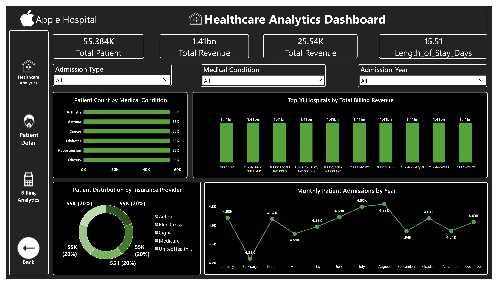
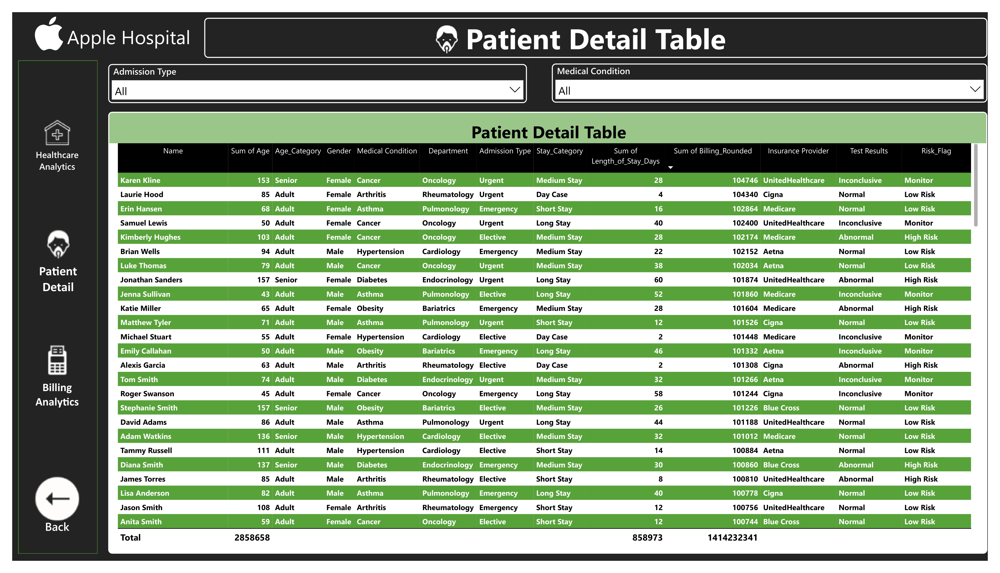
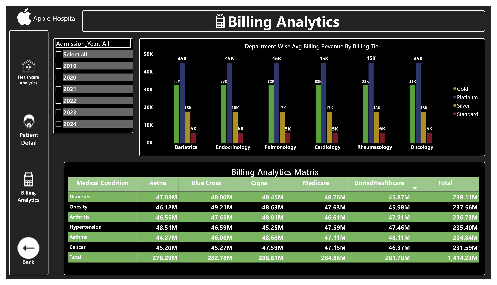

# 🏥 Patient Analytics Dashboard

A professional Power BI dashboard that provides comprehensive insights into patient records, hospital operations, billing, medical conditions, insurance coverage, and healthcare performance.

---

## 📌 Project Overview

This dashboard helps healthcare organizations analyze patient data efficiently by transforming raw hospital records into meaningful visual insights. It enables better decision-making through interactive reports and KPIs.

---

## 🚀 Features

- 📊 Interactive Power BI Dashboard
- 👨‍⚕️ Patient Demographics Analysis
- 🏥 Medical Condition Analysis
- 💰 Billing Amount Analysis
- 🛡️ Insurance Provider Analysis
- 🛏️ Admission Type Analysis
- 📅 Admission & Discharge Trends
- 📈 KPI Cards for Quick Insights
- 🎯 Dynamic Filters (Slicers)
- 📌 Department-wise Performance

---

## 📊 Dashboard Insights

- Total Patients
- Total Billing Amount
- Average Billing Amount
- Medical Condition Distribution
- Insurance Provider Comparison
- Billing Amount by Medical Condition
- Admission Type Breakdown
- Gender Distribution
- Age Group Analysis
- Monthly Admission Trend

---

## 🛠️ Tools & Technologies

- **Power BI Desktop**
- **Power Query**
- **DAX**
- **Microsoft Excel**
- **Data Modeling**

---

## 📂 Dataset

The dashboard uses healthcare patient data containing information such as:

- Patient ID
- Name
- Age
- Gender
- Blood Type
- Medical Condition
- Doctor
- Hospital
- Admission Date
- Discharge Date
- Admission Type
- Insurance Provider
- Billing Amount
- Medication
- Test Results

---

## 📈 KPIs Included

| KPI | Description |
|------|-------------|
| Total Patients | Number of Patients |
| Total Billing | Overall Revenue |
| Average Billing | Average Billing per Patient |
| Average Age | Average Patient Age |
| Total Medical Conditions | Count of Conditions |
| Insurance Coverage | Provider Distribution |

---

---

## 📸 Dashboard Preview

### Dashboard Overview



### Patient & Billing Analysis



### Medical Condition & Insurance Analysis



---
---

## 📁 Project Structure

```
Hospital-Analytics-Dashboard/
│
├── PR--2.pbix
├── README.md
└── images/
    ├── dashboard.png
    ├── overview.png
    └── insights.png
```

---

## ⚙️ How to Use

1. Clone the repository

```bash
git clone https://github.com/darshanpatil115533-ui/Hospital_Management_PR2.git
```

2. Open the `.pbix` file using **Power BI Desktop**

3. Refresh the data if needed

4. Explore the interactive dashboard

---

## 📷 Visualizations Used

- KPI Cards
- Matrix
- Bar Chart
- Column Chart
- Pie Chart
- Donut Chart
- Line Chart
- Slicers
- Tables

---

## 📚 Skills Demonstrated

- Data Cleaning
- Data Transformation
- Data Modeling
- DAX Measures
- Power Query
- Dashboard Design
- Business Intelligence
- Data Visualization

---

## 💡 Future Improvements

- SQL Integration
- Real-Time Dashboard
- Predictive Analytics
- Power BI Service Deployment
- Row-Level Security (RLS)

---

## 👨‍💻 Author

**Darshan Patil**

- GitHub: https://github.com/darshanpatil115533-ui

---

## ⭐ If you like this project

Give it a ⭐ on GitHub!

---

## 📄 License

This project is for educational and portfolio purposes.
